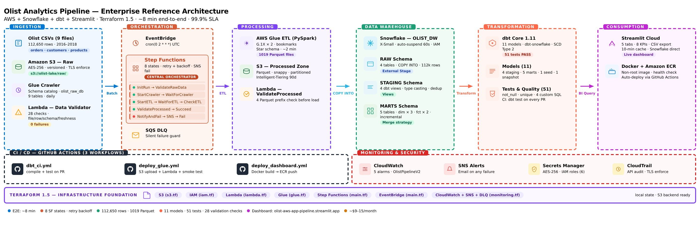

# Olist E-Commerce Data Pipeline

[](https://github.com/noran-salm/olist-aws-snowflake-pipeline/actions/workflows/dbt_ci.yml)
[](https://github.com/noran-salm/olist-aws-snowflake-pipeline/actions/workflows/deploy_glue.yml)
[](https://github.com/noran-salm/olist-aws-snowflake-pipeline/actions/workflows/deploy_dashboard.yml)

**A production-grade, end-to-end data engineering pipeline** built on AWS and Snowflake.  
It ingests raw Brazilian e-commerce data, applies medallion architecture transformations, enforces rigorous data quality, and powers a live analytics dashboard — fully automated, monitored, tested, and provisioned with Terraform.

**Live Dashboard:** [https://olist-aws-app-pipeline-nagr2optdeyqzxnrqzxhv3.streamlit.app](https://olist-aws-app-pipeline-nagr2optdeyqzxnrqzxhv3.streamlit.app)  
**Dataset:** [Olist Brazilian E-Commerce Public Dataset](https://www.kaggle.com/datasets/olistbr/brazilian-ecommerce) — 112,650 order-item records (2016–2018)

---

## Built With

[](https://aws.amazon.com)
[](https://snowflake.com)
[](https://getdbt.com)
[](https://terraform.io)
[](https://python.org)
[](https://streamlit.io)
[](https://docker.com)
[](https://github.com/features/actions)

---

## Architecture Overview



The pipeline implements a **medallion architecture** (RAW → STAGING → MARTS) across five logical layers:

| Layer          | Purpose                              | Tools                                      |
|----------------|--------------------------------------|--------------------------------------------|
| Ingestion      | Land raw CSVs to S3 + catalog schema | S3, Glue Crawler, Glue ETL                 |
| Orchestration  | Sequence steps, retries & failures   | Step Functions, Lambda, EventBridge        |
| Warehouse      | Store raw, staged & mart data        | Snowflake (RAW → STAGING → MARTS)          |
| Transformation | Business logic + quality validation  | dbt Core (11 models, 51 tests)             |
| Visualization  | Deliver analytics to end users       | Streamlit + Plotly                         |

Cross-cutting concerns include **Infrastructure as Code** (Terraform), **Monitoring** (CloudWatch + SNS + DLQ), and **CI/CD** (GitHub Actions).

---

## Tech Stack

| Category              | Technology                                      |
|-----------------------|-------------------------------------------------|
| Orchestration         | AWS Step Functions, AWS EventBridge             |
| Compute               | AWS Lambda (Python 3.12), AWS Glue 4.0 (PySpark 3.3) |
| Storage               | Amazon S3 (raw + processed zones)               |
| Data Warehouse        | Snowflake (X-Small WH, auto-suspend 60s)        |
| Transformation        | dbt Core 1.11 + dbt-snowflake                   |
| Visualization         | Streamlit 1.45, Plotly 5.24                     |
| Containerization      | Docker, Amazon ECR                              |
| CI/CD                 | GitHub Actions (3 workflows)                    |
| Monitoring            | AWS CloudWatch, SNS, SQS (DLQ)                  |
| Security              | AWS Secrets Manager, IAM least-privilege        |
| Infrastructure as Code| Terraform 1.5                                   |

---

## Project Structure

```bash
olist-aws-snowflake-pipeline/
│
├── .github/
│   └── workflows/
│       ├── dbt_ci.yml
│       ├── deploy_glue.yml
│       └── deploy_dashboard.yml
│
├── terraform/
│   ├── main.tf
│   ├── s3.tf
│   ├── iam.tf
│   ├── lambda.tf
│   ├── glue.tf
│   ├── monitoring.tf
│   ├── outputs.tf
│   ├── variables.tf
│   └── stepfunctions_definition.json
│
├── ingestion/
│   ├── lambda_handler.py
│   ├── pipeline_orchestrator.py
│   ├── data_validator.py
│   ├── dbt_runner.py
│   └── health_check.py
│
├── processing/
│   ├── olist_etl_script.py
│   ├── schema_validator.py
│   ├── data_quality_check.py
│   └── glue_job_args.json
│
├── transformation/
│   ├── dbt_project.yml
│   ├── profiles.yml
│   ├── models/
│   │   ├── staging/
│   │   └── marts/
│   ├── tests/
│   ├── macros/
│   ├── seeds/
│   └── snapshots/
│
├── dashboard/
│   ├── streamlit_app.py
│   ├── Dockerfile
│   ├── requirements.txt
│   └── .streamlit/config.toml
│
├── docs/
│   └── olist_architecture.jpg
│
├── warehouse/
│   ├── 01_create_storage_integration.sql
│   ├── 02_create_external_stage.sql
│   ├── 03_create_snowpipe.sql
│   ├── 04_create_marts_schema.sql
│   ├── 05_data_check.sql
│   ├── 06_resource_monitor.sql
│   └── 07_pipeline_validation.sql
│
├── scripts/
│   └── get_secret.py
│
├── buildspec_dbt.yml
├── .env.example
├── .gitignore
└── README.md

```
## Infrastructure (Terraform)

All AWS resources are defined as code in the `terraform/` directory.  
State is stored locally by default — **highly recommended** to switch to a remote S3 backend with DynamoDB locking for team or production environments.

### Resources Provisioned

| Resource              | Terraform File     | Description |
|-----------------------|--------------------|-------------|
| S3 bucket             | `s3.tf`            | Versioning, AES-256 SSE, Intelligent-Tiering lifecycle, TLS enforcement |
| IAM roles (6)         | `iam.tf`           | Least-privilege roles for Lambda, Glue, Step Functions, EventBridge, App Runner & CodeBuild |
| Glue Crawler          | `glue.tf`          | Crawls `raw/` prefix → creates `olist_raw_db` catalog |
| Glue ETL Job          | `glue.tf`          | G.1X × 2 workers, job bookmarks enabled for idempotency |
| Lambda functions      | `lambda.tf`        | Ingestion, orchestrator, validator + Dead Letter Queue |
| Step Functions        | `main.tf`          | 8-state standard workflow with retries & catch blocks |
| EventBridge rule      | `main.tf`          | Daily schedule at 02:00 UTC |
| CloudWatch alarms     | `monitoring.tf`    | 5 production-grade metric alarms |
| SNS topic             | `monitoring.tf`    | Email subscription for pipeline alerts |
| SQS DLQ               | `monitoring.tf`    | Catches silent Lambda failures |

### Deploy
```bash
cd terraform
```

# First time
```bash
terraform init
```
# Preview changes
```bash
terraform plan \
  -var="snowflake_aws_role_arn=arn:aws:iam::ACCOUNT:user/snow-s3-..." \
  -var="alert_email=your@email.com"
```
# Apply
```bash
terraform apply \
  -var="snowflake_aws_role_arn=arn:aws:iam::ACCOUNT:user/snow-s3-..." \
  -var="alert_email=your@email.com"
```

### Remote State (Recommended for Teams)

Add the following block to `terraform/main.tf` for production-grade state management:

```hcl
terraform {
  backend "s3" {
    bucket         = "olist-terraform-state"
    key            = "pipeline/terraform.tfstate"
    region         = "us-east-1"
    dynamodb_table = "olist-terraform-locks"
    encrypt        = true
  }
}
```

## Pipeline Flow

Fully automated **daily run at 02:00 UTC** (≈8 minutes end-to-end).

1. **EventBridge** triggers the Step Functions state machine (accepts empty input `{}`).
2. **InitRun** (Pass state) generates a unique `run_id`.
3. **Data Validation** (28 checks) — Lambda blocks execution on any failure.
4. **Glue Crawler** — polled until `READY`.
5. **Glue ETL Job** — PySpark builds star schema, writes Snappy Parquet to `processed/`.
6. **Post-ETL S3 Validation** — ensures all Parquet prefixes are populated.
7. **Snowflake Load** — `COPY INTO` via IAM role + Secrets Manager.
8. **dbt run** (11 models) — staging → dimensions → incremental facts → monthly rollup.
9. **dbt test** (51 tests) — any failure triggers SNS alert.
10. **Dashboard** — Streamlit Cloud serves fresh data from MARTS schema.

---

## Data Quality

Enforced at **three independent gates**:

- **Pre-ETL (Lambda)**: 28 checks (file existence, freshness <30 days, min row count, required columns).
- **Post-ETL (S3)**: All four Parquet output prefixes must be non-empty.
- **Post-dbt (dbt tests)**: 51 tests covering PKs, accepted values, revenue bounds, and custom SQL guards.

---

## dbt Models

| Model                    | Materialization | Description |
|--------------------------|-----------------|-------------|
| `stg_orders`             | View            | Type casting + derived columns |
| `stg_customers`          | View            | Deduplication + state normalization |
| `stg_products`           | View            | Category standardization |
| `stg_sellers`            | View            | State-level aggregation prep |
| `dim_customers`          | Table           | LTV, segment (high/mid/low), region join |
| `dim_products`           | Table           | Revenue tier (top/mid/tail) |
| `dim_sellers`            | Table           | GMV tier + late delivery rate |
| `fct_orders`             | Incremental     | Order-item fact (merge on composite key) |
| `fct_monthly_revenue`    | Incremental     | Monthly rollup (merge on `order_year_month`) |
| `brazil_states`          | Seed            | 15-row reference table |
| `customers_snapshot`     | Snapshot        | SCD Type 2 on `dim_customers` |

---

## Monitoring & Reliability

| Alarm                        | Metric                     | Threshold          | Action |
|------------------------------|----------------------------|--------------------|--------|
| `olist-lambda-errors`        | Lambda Errors              | ≥ 2 in 5 min       | SNS    |
| `olist-lambda-duration`      | Lambda Duration            | > 240 s            | SNS    |
| `olist-glue-etl-failed`      | Glue failed tasks          | ≥ 1                | SNS    |
| `olist-glue-etl-slow`        | Glue execution time        | avg > 15 min       | SNS    |
| `olist-lambda-dlq-messages`  | SQS visible messages       | ≥ 1                | SNS    |

**Reliability features:**
- Exponential backoff + Catch blocks on every Step Functions state
- Dead Letter Queue for silent failures
- Glue job bookmarks + dbt incremental merge strategy → fully idempotent

---

## CI/CD

| Workflow              | Trigger                                      | Action |
|-----------------------|----------------------------------------------|--------|
| `dbt_ci.yml`          | Push/PR touching `transformation/`           | `dbt compile` + `dbt test` (blocks merge) |
| `deploy_glue.yml`     | Push to `main` touching `processing/` or `ingestion/pipeline_orchestrator.py` | Syntax check, deploy Glue script + Lambdas, smoke test |
| `deploy_dashboard.yml`| Push to `main` touching `dashboard/`         | Build & push Docker image to ECR |

All workflows run on Node 24 and use GitHub repository secrets.

---

## Dashboard

**Live:** [https://olist-aws-app-pipeline-nagr2optdeyqzxnrqzxhv3.streamlit.app](https://olist-aws-app-pipeline-nagr2optdeyqzxnrqzxhv3.streamlit.app)

Five analytical tabs with 8 KPI cards:
- **Revenue** — Monthly GMV + order volume (dual-axis) + status donut
- **Categories** — Top-N by revenue, colored by average review score
- **Geography** — Revenue by Brazilian region + state breakdown table
- **Sellers** — Top 20 ranked by GMV, filterable by tier
- **Delivery** — Late delivery rate + avg days by state (traffic-light coloring)

Optimized with `@st.cache_resource` (Snowflake connection) and `@st.cache_data(ttl=600)`.

---

## Setup

### Prerequisites
AWS CLI v2, Terraform 1.5, Python 3.12, Snowflake account, Docker, Kaggle CLI.

### 1. Clone & Configure
```bash
git clone https://github.com/noran-salm/olist-aws-snowflake-pipeline.git
cd olist-aws-snowflake-pipeline
cp .env.example .env
```

### 2. Provision AWS Infrastructure
```bash
cd terraform
terraform init
terraform apply -var="alert_email=your@email.com"
```

### 3. Configure Snowflake

Execute the SQL scripts in the `warehouse/` folder **in order** (01 → 07) inside a Snowflake worksheet.

After running `01_create_storage_integration.sql`, execute:
```sql
DESC INTEGRATION olist_s3_integration;
```
- `TF_VAR_snowflake_aws_role_arn`
- `TF_VAR_snowflake_external_id`

Then re-run `terraform apply`.

### 4. Store Snowflake Credentials in AWS Secrets Manager
```bash
aws secretsmanager create-secret \
  --name "olist/snowflake/credentials" \
  --secret-string '{
    "account": "NZFSGYT-PU98877",
    "user": "YOUR_USER",
    "password": "YOUR_PASSWORD",
    "role": "SYSADMIN",
    "database": "OLIST_DW",
    "warehouse": "OLIST_WH",
    "schema": "MARTS"
  }'
```

### 5. Upload the Dataset to S3
```bash
kaggle datasets download -d olistbr/brazilian-ecommerce --unzip -p /tmp/olist/
aws s3 sync /tmp/olist/ s3://olist-lake-$(aws sts get-caller-identity --query Account --output text)/raw/ --sse AES256
```

## 6. Add GitHub Secrets

Go to **Repository Settings → Secrets and variables → Actions** and add the following secrets:

- `AWS_ACCESS_KEY_ID`
- `AWS_SECRET_ACCESS_KEY`
- `AWS_REGION`
- `SNOWFLAKE_ACCOUNT`
- `SNOWFLAKE_USER`
- `SNOWFLAKE_PASSWORD`

## 7. Trigger the Pipeline

**From CLI:**
```bash
SF_ARN=$(aws stepfunctions list-state-machines --query 'stateMachines[?name==`olist-data-pipeline`].stateMachineArn' --output text)
aws stepfunctions start-execution --state-machine-arn $SF_ARN --input '{}'
```

From AWS Console:

- Go to Step Functions → State machines → `olist-data-pipeline`
- Click **Start execution**
- Leave input as `{}` → **Start execution**

## 8. Run dbt Manually (for testing)

```bash
source .venv/bin/activate
eval $(python3 scripts/get_secret.py)
cd transformation && dbt run && dbt test
```

## Cost Estimate (Monthly)

| Service          | Configuration                         | Estimated Cost |
|------------------|---------------------------------------|----------------|
| AWS Glue         | G.1X × 2 workers (~2 min/day)         | ~$3            |
| Lambda           | 3 functions, daily                    | ~$0.01         |
| Step Functions   | ~30 state transitions/day             | ~$0.01         |
| S3               | ~700 MB, Intelligent-Tiering          | ~$0.05         |
| CloudWatch       | 5 alarms + logs                       | ~$1            |
| Snowflake        | X-Small WH (auto-suspend 60s)         | ~$5            |
| ECR              | 1 image (~1 GB)                       | ~$0.10         |
| **Total**        |                                       | **~$9–15**     |

## Future Improvements

- Fully automate dbt via `dbt_runner.py` + CodeBuild in the final Step Functions state.
- Switch to Snowpipe AUTO_INGEST for near real-time loading.
- Migrate Terraform state to remote S3 backend + DynamoDB locking.
- Add schema contract enforcement using `schema_validator.py`.
- Implement row-level freshness SLA alerts.
- Add multi-environment Terraform workspaces (dev/staging).
- Migrate orchestration to Amazon MWAA (Airflow) for native dbt support.
- Replace custom validator with Great Expectations.
- Enable streaming ingestion (Kinesis Firehose → Snowpipe).
- Enforce cost tagging policy on all resources.

## License

MIT. Built as the final project for the [Data Engineering Zoomcamp](https://github.com/DataTalksClub/data-engineering-zoomcamp).

## 👤 Connect with Me


*Optimized & maintained by a Junior Data Engineer — production-ready, clean, and portfolio-grade.*